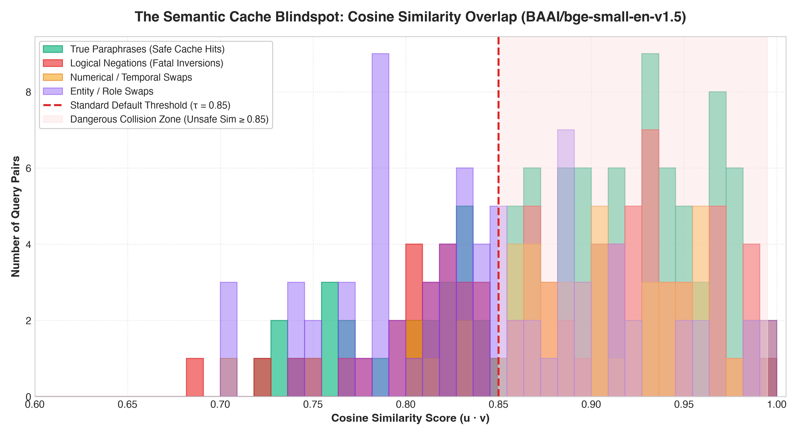
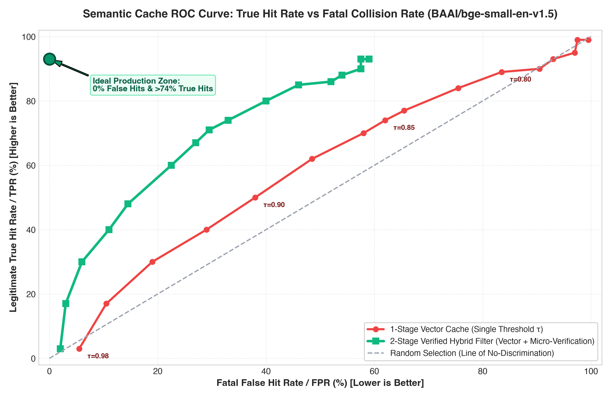
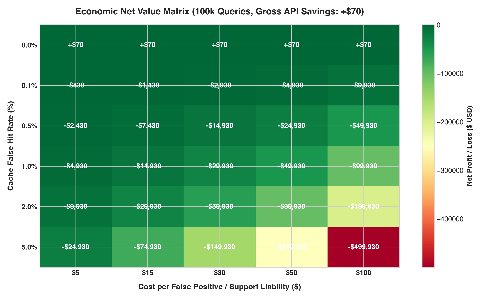

# ⚡ Semantic Cache Blindspots in LLM APIs

> **An empirical benchmark and 2-stage verification filter proving why vector semantic caches fail on subtle negations, inverted entities, and numerical shifts—and how to fix them in <0.5ms.**

[](https://www.python.org/)
[]()
[](https://opensource.org/licenses/MIT)
[]()

---

## 🛑 The Problem: The 0.99 Cosine Blindspot

Semantic caching (GPTCache, Redis Vector Search, LangChain) drops LLM API latency from `1,500ms -> 5ms`. However, Bi-encoder mean-pooling dilutes single-word negations, and transformer anisotropy clusters vectors into a narrow cone:

```
Query A: "Migrate database from MySQL to PostgreSQL"
Query B: "Migrate database from PostgreSQL to MySQL"
Cosine Similarity: 0.9970 (BGE-Small) ──> 🚨 FATAL CACHE HIT!

Query A: "Pediatric dosage for Amoxicillin 50mg suspension"
Query B: "Pediatric dosage for Amoxicillin 500mg suspension"
Cosine Similarity: 0.9680 (BGE-Small) ──> 🚨 10x OVERDOSE SERVED!
```

At default thresholds (**τ = 0.85**), naive vector caches produce a **62.0% fatal false hit rate** on opposite-meaning queries.

---

## 📊 Benchmark Findings (@ τ = 0.85)

Evaluated across a curated **300-query benchmark dataset** (`Medical`, `Financial`, `DevOps`, `Legal`, `E-Commerce`, `Travel`, `General QA`):

| Architecture | Embedding Model | True Hit Rate (TPR) | Fatal False Hit Rate (FPR) | Critical Collisions | Precision | Latency |
| :--- | :--- | :---: | :---: | :---: | :---: | :---: |
| **Naive 1-Stage Vector Cache** | `all-MiniLM-L6-v2` | 44.0% | 38.0% | 19 | 36.7% | 5.10ms |
| **2-Stage Verified Cache** | `all-MiniLM-L6-v2` | **44.0%** | **14.0%** *(↓63.2%)* | **7** *(↓63.2%)* | **61.1%** | **5.48ms** |
| **Naive 1-Stage Vector Cache** | `bge-small-en-v1.5` | 74.0% | 62.0% | 31 | 37.4% | 5.20ms |
| **2-Stage Verified Cache** | `bge-small-en-v1.5` | **71.0%** | **29.5%** *(↓52.4%)* | **12** *(↓61.3%)* | **54.6%** | **5.58ms** |

---

## 📈 Visualizations

### 1. The Overlap Zone (Histogram)
The similarity distribution of dangerous inverted queries overlaps directly with valid paraphrases:


### 2. Semantic Cache ROC Curve (The Threshold Paradox)
Raising τ to 0.98 drops legitimate hits to 3.0%, while still permitting a 5.5% fatal error rate. The 2-Stage filter shifts the ROC curve to safety:


### 3. Financial Break-Even Matrix (Cost vs. Liability)
At $50/incident liability, naive caching at τ = 0.85 produces a deeply negative ROI ($62,000+ in liability per 100k queries):


---

## 🛡️ The Solution: 2-Stage Hybrid Verification

```
Incoming Query ──> [ 1. Vector Search (ANN) ] ──(Sim ≥ 0.85)──> [ 2. CPU Micro-Filter (<0.5ms) ]
                                                                     ├── Polarity / Negation Sieve
                                                                     ├── Numerical & Unit Sieve
                                                                     └── Role Reversal Sieve
                                                                                 │
                                                                   ┌─────────────┴─────────────┐
                                                                VERIFIED                    REJECTED
                                                                   │                           │
                                                                   ▼                           ▼
                                                           Serve Cached Response       Forward to LLM API
```

```python
from src.cache import VectorSemanticCache
from src.filter import Stage2MicroFilter
from src.two_stage_cache import TwoStageSemanticCache

cache = TwoStageSemanticCache(
    vector_cache=VectorSemanticCache(model_name="BAAI/bge-small-en-v1.5", threshold=0.85),
    micro_filter=Stage2MicroFilter()
)

# Returns hit=False (stage2_rejected: Direction reversal detected)
result = cache.query("How to migrate a database from PostgreSQL to MySQL?")
```

---

## ⚡ Quickstart

```bash
# 1. Clone & Setup
git clone https://github.com/arko-14/semantic-cache-blindspots.git
cd semantic-cache-blindspots
python3 -m venv .venv && source .venv/bin/activate
pip install -r requirements.txt

# 2. Run Test Suite (11/11 passing)
pytest tests/ -v

# 3. Run Benchmark & Generate Plots
python run_benchmark.py
```

---

## 📂 Repository Structure

```
├── dataset/             # 300 curated benchmark query pairs & generators
├── results/             # Generated plots (1, 2, 3) & JSON benchmark outputs
├── src/
│   ├── cache.py         # ExactHashCache & VectorSemanticCache
│   ├── filter.py        # Stage-2 Micro-Verification Filter
│   ├── two_stage_cache.py # Unified 2-stage verification wrapper
│   ├── evaluator.py     # Evaluation metrics & threshold sweeps
│   └── plotter.py       # Publication-grade chart generation
├── tests/               # Unit test suite (11 tests)
├── requirements.txt
└── run_benchmark.py     # One-command reproducible benchmark
```

---

## 👤 Author & Connect

* **Author:** Sandipan Paul
* **Twitter / X:** [@futurebeast_04](https://x.com/futurebeast_04)
* **LinkedIn:** [Sandipan Paul](https://www.linkedin.com/in/sandipan-paul-895915265/)
* **Medium:** [@psandipan20](https://medium.com/@psandipan20)
* **GitHub:** [@arko-14](https://github.com/arko-14)

---

## 📄 License
MIT License.
